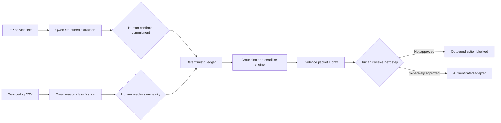
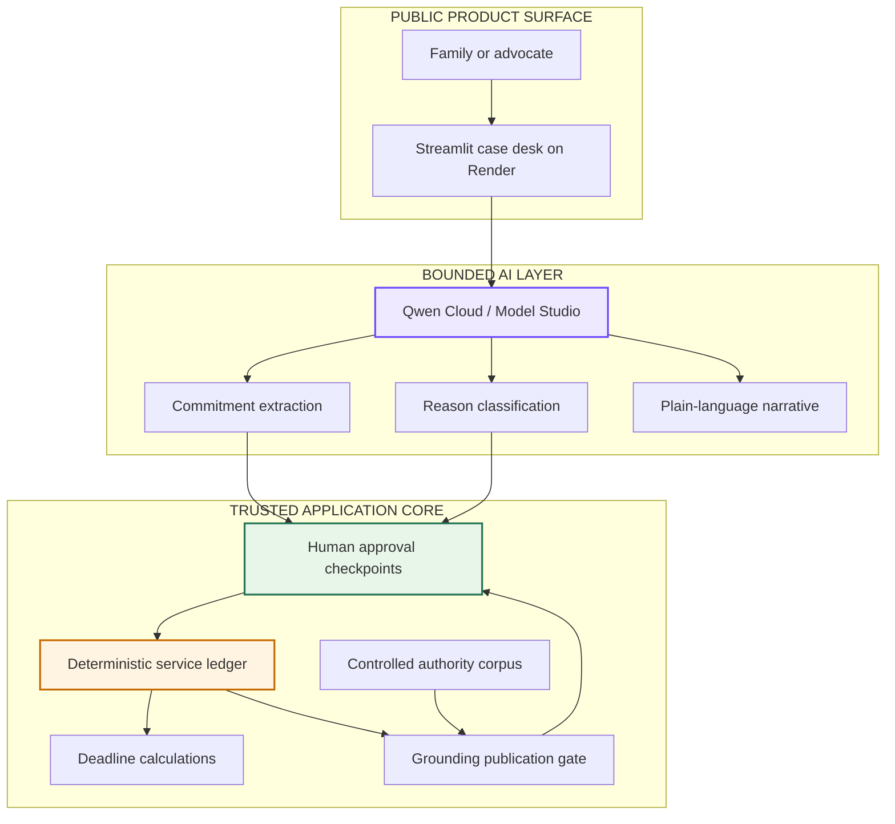

# Due Process — IEP Evidence Operations

[](https://www.python.org/)
[](https://www.alibabacloud.com/en/product/modelstudio)
[](https://due-process-iep-evidence.onrender.com)
[](https://github.com/ankitlade12/due-process-iep-agent/actions/workflows/ci.yml)
[](#reproducible-engineering-verification)
[](LICENSE)

> **An IEP says what a school promised. Due Process shows what the records prove—and keeps every next step under human control.**

Due Process is an evidence-operations workspace for families, advocates, and
special-education teams. It turns an IEP service commitment and months of delivery
logs into a reconciled ledger, a source-grounded evidence packet, and a draft next
step for human review.

Qwen handles narrow language tasks. Deterministic code owns the arithmetic,
deadlines, policy threshold, and citation validation. The public product never
emails, files, or uploads a packet; downloaded output stays with the reviewer.

Built for the **Global AI Hackathon Series with Qwen Cloud**, Track 4: Autopilot
Agent.

## Quick highlights

- **Promised vs. delivered ledger** — reconciles required, delivered, excused,
  unexcused, short, and make-up service minutes
- **Bounded Qwen reasoning** — extracts messy IEP service language and classifies
  free-text missed-session reasons into fixed schemas
- **Human-owned interpretation** — extracted commitments must be confirmed and
  ambiguous records must be resolved before analysis continues
- **Evidence receipts** — each finding points to the exact IEP provision, service
  log rows, and controlled legal authorities that support it
- **Deterministic consequences** — models never calculate shortfalls, select legal
  citations, or decide whether a review threshold was crossed
- **Safe drafting** — prepares a review packet or complaint draft but never sends
  or files it
- **Privacy-gated case intake** — the public app accepts only synthetic or already
  de-identified records and includes a complete redacted demonstration kit
- **Public product** — deployed Render workspace with verified Qwen Cloud calls

## Live deployment

| Surface | URL | Access |
|---|---|---|
| **Product workspace** | [due-process-iep-evidence.onrender.com](https://due-process-iep-evidence.onrender.com) | Public; synthetic/de-identified data only |
| **Health check** | [/_stcore/health](https://due-process-iep-evidence.onrender.com/_stcore/health) | Public |
| **Source repository** | [github.com/ankitlade12/due-process-iep-agent](https://github.com/ankitlade12/due-process-iep-agent) | Public |

The public presentation layer runs on Render. Live analysis uses Qwen Cloud for
bounded extraction, classification, and narrative tasks. Deterministic analysis
and human-review gates run inside the application service.

## Sixty-second product tour

1. Open the [live workspace](https://due-process-iep-evidence.onrender.com).
2. Leave **Synthetic worked example** selected and choose **Start Qwen review**.
3. Inspect Qwen's structured commitment, confirm it, and run the deterministic
   ledger.
4. Open **Evidence Packet** to trace a finding back to its IEP, log, and legal
   sources.
5. Open **Human Approval** to verify that outbound action remains blocked.
6. Open **Technical Proof** to see the models, per-call provenance, and the
   deterministic rationale.

To demonstrate real intake instead, choose **Upload redacted case** and follow the
[redacted live-demo case](docs/REDACTED_DEMO_CASE.md). The app supplies both the
uploadable CSV and the supporting note needed to resolve its deliberate ambiguity.

## Architecture

### Product workflow



### Runtime architecture



The central design rule is simple: **Qwen may interpret language, but it cannot
establish the consequential facts alone.** A human confirms interpretation;
deterministic code computes the result; a grounding gate verifies every published
claim.

### Technology stack

| Layer | Technology | Responsibility |
|---|---|---|
| **Product surface** | Streamlit | Case intake, review checkpoints, evidence packet, technical proof |
| **Language/runtime** | Python 3.10+ | Typed domain models and agent orchestration |
| **Model layer** | Qwen Cloud via Model Studio's OpenAI-compatible API | Bounded extraction, classification, vision, and narrative tasks |
| **Analysis core** | Custom deterministic Python engine | Ledger arithmetic, materiality screening, deadlines, make-up reconciliation |
| **Grounding** | Controlled IDEA / CFR / U.S.C. / case-law corpus | Source resolution and claim publication gate |
| **Local persistence** | SQLite | Case memory and deadline agenda |
| **Frontend deployment** | Render Blueprint | Public Streamlit service and health check |
| **Testing** | pytest + GitHub Actions | Unit, integration, privacy, grounding, deployment, and evaluation coverage |

## The problem

An IEP meeting produces a service promise, but proof of delivery is scattered
across weekly logs, absence notes, provider comments, and calendars. When sessions
are missed, a family or advocate must answer four different questions:

- What exactly did the IEP require?
- Which sessions were delivered, excused, missed, shortened, or made up?
- Which source records support each concern?
- Which safe next step is available before a filing window closes?

General-purpose chatbots can summarize a document, but a plausible paragraph is
not an auditable service ledger. High-stakes evidence work needs provenance,
repeatable calculations, explicit uncertainty, and human control.

## The solution

Due Process converts records into a reviewable chain of evidence:

1. Qwen extracts a structured commitment from the IEP service language.
2. A human compares every extracted field with the source.
3. Qwen classifies clear missed-session reasons and escalates unclear ones.
4. A human resolves each ambiguity using the underlying record.
5. Deterministic code reconciles required and recorded minutes.
6. The grounding gate attaches real IEP, log, and authority references.
7. The agent drafts an evidence packet and holds it for human review.
8. External action remains unavailable unless a separate authenticated approval is
   provided.

The result is not an automated lawyer. It is an auditable evidence-operations
workspace that helps a human review the record faster and more consistently.

## Product capabilities

### Real-record intake

- CSV/TSV service logs with fuzzy header mapping and status inference
- text-based PDF ingestion
- Qwen vision path for synthetic or already-redacted scanned IEP images
- explicit privacy attestation on the public upload workflow
- packaged redacted case with a separate source note for the human checkpoint

### Deterministic evidence ledger

- required vs. delivered session and minute totals
- excused, unexcused, incomplete, and ambiguous buckets
- short-session and make-up-session reconciliation
- configurable 15% product review threshold, clearly labeled as a screening
  signal rather than a legal bright line
- one-year state-complaint and two-year due-process deadline calculations

### Grounded review packet

- IEP commitment excerpt
- exact supporting service-log row IDs
- controlled legal authority references
- numbered exhibit index
- human-review complaint draft
- downloadable text packet

### Human and privacy controls

- confirmation before extracted values affect analysis
- unresolved ambiguity blocks deterministic finalization
- no automated email or filing action
- direct-identifier redaction before text-model calls
- no public aggregation below the configured k-anonymity threshold
- reviewer-controlled packet downloads with no automated outbound action

## Deterministic core, bounded Qwen

| Deterministic code owns | Qwen is allowed to do |
|---|---|
| Required and delivered minute arithmetic | Extract service commitments into a fixed schema |
| Review-threshold calculation | Classify reason text as excused, unexcused, or ambiguous |
| Deadline calculations | Read a synthetic/redacted scanned IEP |
| Make-up reconciliation | Draft plain-language narrative inside a fixed structure |
| Authority selection and source-ID validation | Explain its bounded classification rationale |
| Publication rejection for ungrounded claims | Never approve, send, file, or store evidence |

Every model task has a transparent local fallback. Without a Qwen key, the product
still runs through its deterministic rules and templates and labels that mode
honestly in the interface.

## Quick start

### Prerequisites

- Python 3.10+
- [`uv`](https://docs.astral.sh/uv/) recommended, or a standard Python virtual
  environment
- optional Qwen Cloud API key for live model-backed review

### Install and run

```bash
git clone https://github.com/ankitlade12/due-process-iep-agent.git
cd due-process-iep-agent

uv venv
uv pip install -e ".[dev,llm,ingest,demo]"

cp .env.example .env
# Add DASHSCOPE_API_KEY only if live Qwen execution is desired.

streamlit run src/due_process/examples/case_desk.py
```

The full synthetic workflow works without an API key through explicit offline
fallbacks.

### Useful commands

```bash
# Canonical 108-session worked example
python -m due_process.examples.worked_example

# Full guarded agent workflow
python -m due_process.examples.agent_demo

# Qwen Cloud smoke test
python -m due_process.examples.qwen_smoketest

# Scanned synthetic IEP path
python -m due_process.examples.vision_demo

# Privacy-gated cohort pattern demo
python -m due_process.examples.systemic_demo

# Synthetic policy-regression verification
python -m due_process.evaluation.run_eval --offline
```

The installed CLI also accepts service logs directly:

```bash
due-process analyze --logs service_log.csv --service speech --freq 3 \
  --duration 30 --periods 36 --state NY --draft \
  --packet complaint_packet.txt
```

## Reproducible engineering verification

```bash
# Full offline suite
uv run --extra dev pytest

# Constructed policy-regression scenarios
python -m due_process.evaluation.run_eval --offline --json

# Public deployment health
curl https://due-process-iep-evidence.onrender.com/_stcore/health
```

Current verified result:

```text
145 passed
```

The included offline command is a regression suite, not a performance benchmark:

| Check | Scope | Current result |
|---|---|---|
| Policy implementation | 11 constructed cases labeled from the declared screening rule | 11/11 outputs match the encoded policy |
| Citation-ID integrity | Emitted authority IDs must exist in the controlled corpus | All emitted IDs resolve |
| Shortfall arithmetic | Computed minutes vs. expected values generated from the same synthetic facts | 0-minute accounting difference |
| Over-flagging contrast | Deliberately naive no-threshold fixture | Exercises two known over-flag cases |

These are software-consistency assertions. We deliberately do **not** report
precision, recall, false-positive rate, “citation accuracy,” or legal-outcome
performance from this set: all 11 cases are synthetic, the labels encode the
product's own rule, and the contrast fixture is intentionally weak. One synthetic
scenario is informed by the math-instruction discussion in
[*Van Duyn v. Baker School District 5J*](https://cdn.ca9.uscourts.gov/datastore/opinions/2007/09/05/0535181.pdf),
but it is not a reconstruction or an independent court-labeled example.

Real performance claims require a representative, advocate-labeled,
de-identified dataset collected under an approved protocol. That validation has
not been completed.

## Project structure

```text
due-process-iep-agent/
├── src/due_process/
│   ├── agent.py                 # guarded orchestration and checkpoints
│   ├── ledger.py                # deterministic promised-vs-delivered math
│   ├── grounding.py             # evidence and citation publication gate
│   ├── deadlines.py             # distinct filing-window calculations
│   ├── privacy.py               # text redaction and vision safeguards
│   ├── filing.py                # evidence packet export
│   ├── systemic.py              # privacy-gated cohort signals
│   ├── llm/                     # bounded Qwen tasks and local fallbacks
│   ├── evaluation/              # synthetic policy regression and contrast fixtures
│   ├── instruments/             # fixed drafts and approval contracts
│   └── examples/                # Streamlit desk and runnable demos
├── docs/                        # public architecture and redacted demo guide
├── tests/                       # offline unit and integration suite
├── render.yaml                  # public Streamlit Blueprint
├── pyproject.toml               # package and dependency contract
└── .env.example                 # safe configuration template
```

## Configuration

| Variable | Required | Purpose |
|---|:---:|---|
| `DASHSCOPE_API_KEY` | For live Qwen | Qwen Cloud authentication |
| `DUE_PROCESS_LLM_BASE_URL` | No | Model Studio endpoint override |
| `DUE_PROCESS_ORCHESTRATOR_MODEL` | No | Narrative/orchestration model |
| `DUE_PROCESS_WORKHORSE_MODEL` | No | Extraction and classification model |
| `DUE_PROCESS_VISION_MODEL` | No | Scanned-image model |

Copy [`.env.example`](.env.example) to `.env`; never commit `.env` or cloud
credentials. Production secrets belong in the deployment platform's encrypted
environment-variable store.

## Deployment

### Render presentation layer

[`render.yaml`](render.yaml) defines the public Streamlit service, Python runtime,
build command, model roles, and `/_stcore/health` check. Connect the repository as
a Render Blueprint and configure the secret values requested by the Blueprint.

## Why Due Process is different

| Capability | Generic chatbot | IEP meeting-prep tool | Due Process |
|---|:---:|:---:|:---:|
| Reconciles months of delivery records | ⚠️ prompt-dependent | ⚠️ varies | ✅ deterministic |
| Requires confirmation of extracted commitments | ❌ | ⚠️ | ✅ |
| Escalates ambiguous reasons to a human | ❌ | ⚠️ | ✅ |
| Grounds findings to exact log rows | ❌ | ⚠️ | ✅ |
| Restricts citations to a controlled corpus | ❌ | ⚠️ | ✅ |
| Tracks separate filing clocks | ❌ | ⚠️ | ✅ |
| Reconciles make-up services | ❌ | ⚠️ | ✅ |
| Blocks every outbound action by default | ❌ | ⚠️ | ✅ |
| Separates regression checks from external validation claims | ❌ | ⚠️ | ✅ |
| Supports privacy-gated cohort pattern review | ❌ | ❌ | ✅ |

The novelty is the combination: **bounded language intelligence + deterministic
evidence accounting + source-level provenance + explicit human control.**

## Documentation

Start with the [documentation index](docs/README.md), then use:

- [Architecture and trust boundaries](docs/architecture.md)
- [Redacted live-demo case](docs/REDACTED_DEMO_CASE.md)
- [Security policy](SECURITY.md)

## Safety and scope

Due Process is information, record-review, and drafting support—not legal advice.
Its threshold is a product screening signal, not a legal conclusion. Federal
defaults and controlled authorities must be localized and reviewed by a qualified
person before reliance. Automated redaction is not a FERPA compliance guarantee;
the public demo must receive only synthetic or already-de-identified records.

## Roadmap

- advocate-labeled validation under an approved de-identification protocol
- state-specific authority modules reviewed by qualified local experts
- organization-managed authentication and retention controls for private use
- accessibility and adversarial privacy testing
- case-management integrations behind the same explicit approval contract

## License

[Apache License 2.0](LICENSE) © 2026 Due Process contributors.

---

**Built for the Global AI Hackathon Series with Qwen Cloud.**

*Due Process turns service records into evidence a human can verify, act on, and
defend.*
