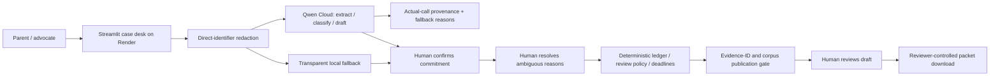
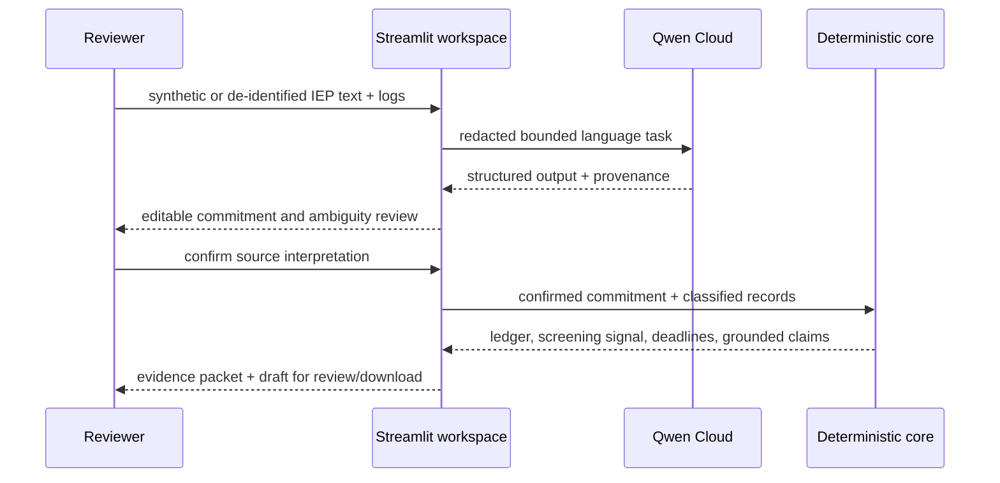

# Architecture

Due Process has one strict boundary: Qwen interprets bounded language inputs;
deterministic code owns consequential calculations, publication checks, and
workflow state. A human confirms interpretations before they affect the ledger.

## Responsibility map

| Layer | Owns | Cannot claim |
|---|---|---|
| Qwen Cloud | service extraction, narrative-reason classification, bounded prose | legal conclusion, ledger math, or successful use when it fell back |
| Deterministic core | minutes, windows, review threshold, deadline indicators | that a configurable threshold is the law |
| Grounding gate | source IDs and controlled corpus resolution | that the corpus is complete or an authority controls a case |
| Human gate | confirms interpretation and reviews the draft | automated legal representation or external action |
| Product surface | redacted intake, audit trail, evidence display, packet download | permission to send, file, or upload the packet |

## Runtime sequence

## Privacy model

- The public UI permits only synthetic or already-de-identified inputs.
- Known direct identifiers are removed before text-model calls, but automated
  redaction is not a FERPA compliance certification.
- Images are riskier because the cloud receives pixels before returning text;
  vision refuses an image without a redacted/synthetic attestation.
- Cross-case pattern analysis requires authority for each case, pseudonyms, and a
  k-anonymity reporting threshold.
- The public workspace does not email, file, or upload generated packets.

## Verification

- `uv run --extra dev pytest` — offline unit and boundary tests.
- `python -m due_process.evaluation.run_eval --offline` — synthetic policy
  regression; implementation consistency, not real-world accuracy.
- `python -m due_process.evaluation.run_eval --online` — exploratory live-Qwen
  contrast; variable and not a benchmark.
- `streamlit run src/due_process/examples/case_desk.py` — product workflow.
