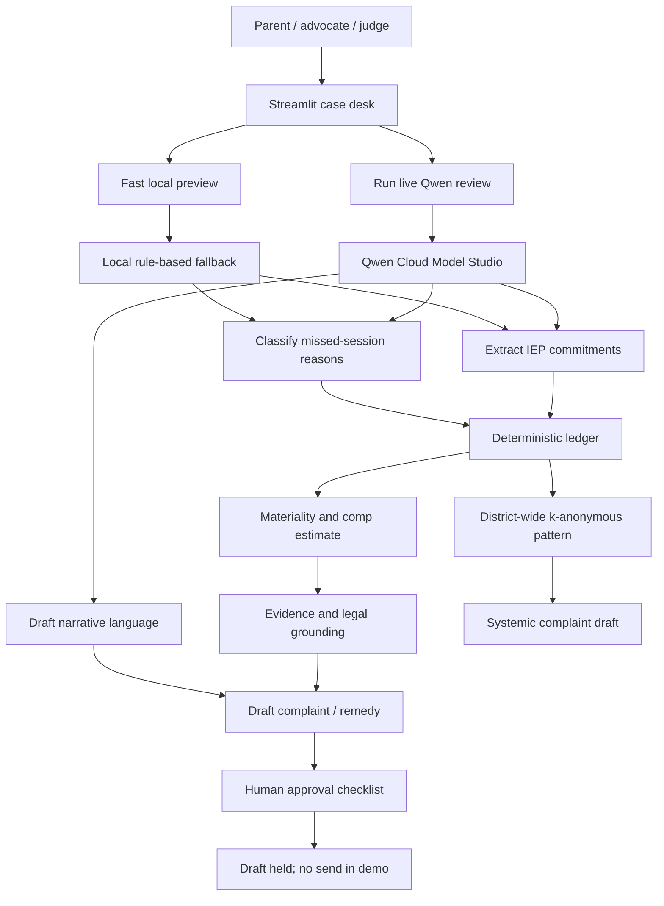
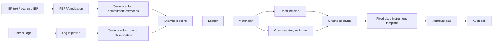
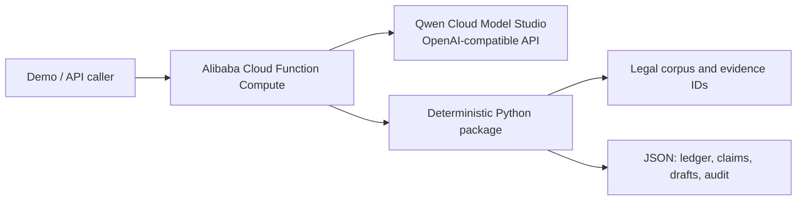

# Architecture

**Due Process** is a Track 4 Autopilot Agent for IEP service-delivery
enforcement. The core design choice is a hard boundary between:

- **Qwen Cloud**, which handles messy language tasks.
- **Deterministic Python**, which handles math, materiality, deadlines,
  grounding, and approval state.
- **A human approval gate**, which blocks every outbound action.

## Demo System

The demo UI is not a static mock. It calls the same backend modules used by the
CLI and tests: extraction, classification, ledger, materiality, grounding,
instrument drafting, systemic aggregation, and approval policy.

## Agent Boundary

| Layer | Responsibility | Why it matters |
|---|---|---|
| Qwen Cloud | IEP commitment extraction, missed-reason classification, narrative language | Handles ambiguous real-world records without giving it legal authority |
| Deterministic core | Required vs delivered minutes, materiality threshold, deadline math, compensatory estimate | Keeps the auditable decisions reproducible and testable |
| Grounding layer | Links every claim to IEP text, log rows, and legal references | Prevents unsupported allegations and hallucinated citations |
| Human approval | Confirm parsed values, resolve ambiguous reasons, approve drafts | Keeps the agent from taking legal or outbound action alone |

The LLM never computes the ledger, decides materiality, selects a legal deadline,
or invents citations. Ambiguous classifications become checkpoints.

## Backend Flow

## Alibaba Cloud Deployment View

The deployed proof path lives in `deploy/`. `handler.py` invokes the package and
uses the Qwen Cloud base URL from `due_process.llm.client`. The response reports
`"llm": "qwen-online"` when Model Studio was called successfully.

## Safety and Privacy

- FERPA-sensitive fields are redacted before cloud model calls.
- Draft instruments are held for human review.
- The demo does not send anything externally.
- Systemic aggregation uses k-anonymity before producing district-level findings.
- The local preview path exists for rehearsal and offline tests, but the primary
  demo path is the live Qwen Cloud review.

## Verification Surface

- `uv run pytest` covers the deterministic core and the case desk payload.
- `python -m due_process.examples.qwen_smoketest` verifies live Qwen extraction,
  classification, and narrative calls.
- `streamlit run src/due_process/examples/case_desk.py` runs the judge-facing
  demo workspace.
- `deploy/handler.py` is the Alibaba Function Compute entrypoint for deployment
  proof.
