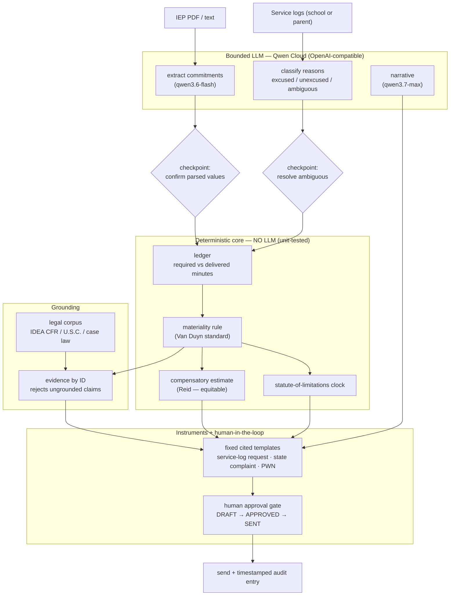
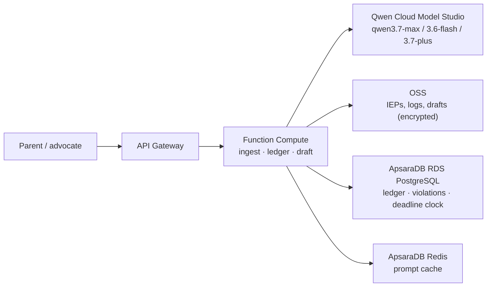

# Architecture

**Due Process** — an IEP enforcement agent (Qwen Cloud hackathon, Track 4:
Autopilot Agent).

## The one idea

A hard boundary between a **deterministic core** that does all the math and the
law lookup, and a **bounded Qwen LLM** that only handles messy language and fills
fixed scaffolds. A human approves every outbound action. Every claim is grounded
to a verifiable source, so a hallucinated citation is impossible by construction.

## System flow

## The deterministic / LLM split

| Deterministic code (auditable) | Qwen LLM (bounded) |
|---|---|
| Minutes arithmetic, the ledger | Classify a free-text missed reason |
| Materiality threshold | Extract commitments from a messy IEP |
| Statute-of-limitations math | Plain-language summary |
| PWN 7-element checklist | Letter narrative into a fixed template |

The LLM never decides materiality, never computes minutes, and never authors the
legal scaffolding or the citations. Ambiguous classifications are flagged for a
human, never auto-resolved.

## Deployment view (Qwen Cloud + Alibaba Cloud)

The deterministic core and the bounded LLM layer are deployment-agnostic Python
today; the proof-of-deployment wraps the agent in a Function Compute handler that
invokes Qwen Cloud Model Studio (the Alibaba Cloud API the hackathon requires).

## Privacy (FERPA)

IEPs and service logs are student education records (FERPA, 20 U.S.C. 1232g; 34
C.F.R. Part 99). PII is redacted before any cloud model call, or the open-weight
Qwen model runs in a private VPC so identifiable records never leave the parent's
control. Encrypted at rest and in transit; no training on uploads.
