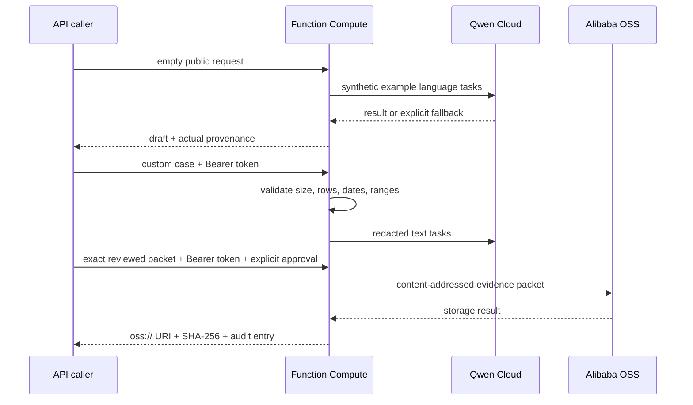

# Architecture

Due Process is a Track 4 Autopilot Agent with one strict boundary: Qwen interprets
ambiguous language; deterministic code owns consequential calculations,
publication checks, and external-action state.

```mermaid
flowchart LR
    U["Parent / advocate"] --> UI["Streamlit case desk"]
    UI --> R["Direct-identifier redaction"]
    R --> Q["Qwen Cloud: extract / classify / draft"]
    Q --> P["Actual-call provenance + fallback reasons"]
    R --> F["Rule fallback"]
    Q --> C1["Human edits + confirms commitment"]
    F --> C1
    C1 --> C2["Human resolves ambiguous reasons"]
    C2 --> D["Deterministic ledger / review policy / deadlines"]
    D --> G["Evidence-ID and corpus publication gate"]
    G --> H["Human review checkpoint"]
    H -->|"explicit approval"| FC["Alibaba Function Compute"]
    FC --> OSS["Alibaba OSS content-addressed packet"]
    OSS --> RCPT["URI + SHA-256 receipt + audit event"]
```

## Responsibility map

| Layer | Owns | Cannot claim |
|---|---|---|
| Qwen Cloud | service extraction, narrative-reason classification, bounded prose | legal conclusion, ledger math, successful use when it fell back |
| Deterministic core | minutes, windows, review threshold, deadline indicators | that a configurable threshold is the law |
| Grounding gate | source IDs and controlled corpus resolution | that the corpus is complete or an authority controls a case |
| Human gate | confirms interpretation and approves external action | automated legal representation |
| OSS adapter | approved packet storage and immutable content hash | permission without an explicit approval flag |

## Deployment boundary

Custom-case requests are disabled until `DUE_PROCESS_API_TOKEN` is configured.
Inputs are bounded to 1 MB, 100,000 IEP characters, 2,000 log rows, a two-year
window, and validated per-row fields. The public no-payload route runs synthetic
data only.

## Privacy model

- Public UI instructions permit only synthetic or already-de-identified inputs.
- Known direct identifiers are removed before text model calls, but automated
  redaction is not a FERPA compliance certification.
- Images are riskier because the cloud receives pixels before returning text;
  vision therefore refuses an image without a redacted/synthetic attestation.
- Cross-case pattern analysis requires the caller to have authority for each case,
  uses pseudonyms, and applies a k-anonymity reporting threshold.
- Production should use a separate least-privilege OSS identity or RAM role,
  retention controls, access logs, encryption, and documented incident response.

## Verification

- `uv run --extra dev pytest` — offline unit and boundary tests.
- `python -m due_process.evaluation.run_eval --offline` — stable benchmark.
- `python -m due_process.evaluation.run_eval --online` — explicit live-Qwen
  comparison; results are variable.
- `streamlit run src/due_process/examples/case_desk.py` — judge-facing workflow.
- `deploy/handler.py` — authenticated Function Compute boundary and OSS action.
